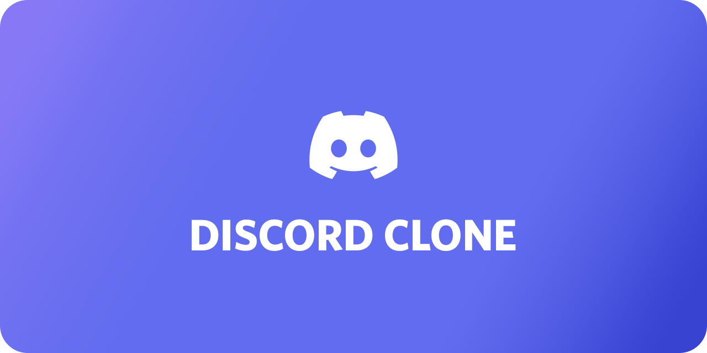
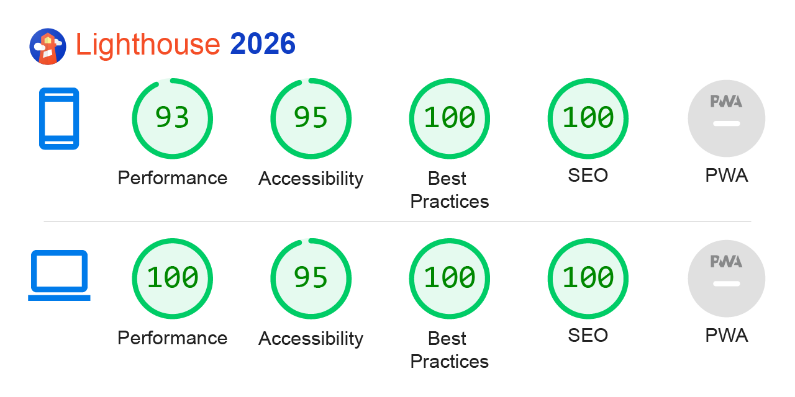

<h1 align="center"> 🎧 Discord Clone 🎤 </h1>


## 📑 Table of Contents

- [📑 Table of Contents](#-table-of-contents)
- [📖 Overview](#-overview)
- [🛠️ Technologies](#-technologies)
- [⚡ Performance & PWA](#-performance--pwa)
- [🚀 Demo](#-demo)
- [📦 Install and Use](#-install-and-use)
- [📂 File Structure](#-file-structure)
- [🎨 Reference & Inspiration](#-reference--inspiration)
- [👨‍💻 Author and Contact](#-author-and-contact)

## 📖 Overview

High-fidelity Discord landing page clone developed to showcase modern frontend optimization and semantic layout patterns. The project focuses on bridging the gap between complex UI replication and extreme performance, utilizing automated asset pipelines and strict accessibility standards.

## 🛠 Technologies

The following technologies were used to build this project:

- [React](https://react.dev/)
- [Typescript](https://www.typescriptlang.org/)
- [Node.js](https://nodejs.org/en)
- [Styled Components](https://styled-components.com/)
- [Vite](https://vite.dev/)

* **Type Aware:** Strict use of semantic HTML5 elements and ARIA attributes for accessibility.

## ⚡ Performance & PWA



* **Automated WebP Pipeline:** Integration of vite-imagetools for on-the-fly image transformation, significantly reducing asset payload.

* **Preload Scanner Optimization:** Implementation of unplugin-inject-preload to ensure critical Hero assets are discoverable before JS execution, optimizing LCP.

* **Transient Props:** Use of the $prop pattern in Styled Components to maintain a clean DOM and zero console warnings regarding non-standard attributes.

* **Resource Prioritization:** Strategic application of fetchpriority="high" for above-the-fold content and native lazy loading for off-screen components.

## 🚀 Demo

Access the live application below to interact with the interface and run your own performance tests

Discord Clone: [https://discord-clone-iota-jet.vercel.app/](https://discord-clone-iota-jet.vercel.app/)

#### Desktop


#### Mobile


## 📦 Install and Use

**Prerequisites:** Node.js (v22.x) or higher installed.

1. Clone the repository:
```bash
git clone https://github.com/Epiled/discord-clone.git
cd discord-clone
```

2. Install the dependencies:
```bash
npm install
```

3. Run the development environment (Build + Watch + Server):
```bash
npm run dev
```

4. (Optional) Generate minified build for production:
```bash
npm run build
```

## 📂 File Structure

Below is the project architecture. All development is done inside the `src/` folder. The `dist/` folder is automatically generated by Vite and should not be edited manually.

```text
discord-clone/
├── src/                # Main source code
│   ├── assets/         # Images and SVGs processed by the build pipeline
│   ├── components/     # Reusable UI components (Atomic Design principles)
│   ├── styles/         # Global styles and theme definitions
│   ├── App.tsx         # Root component
│   └── main.tsx        # Application entry point
├── public/             # Static assets (favicons, robots.txt)
├── @types/             # Global TypeScript definitions (on root)
├── vite.config.ts      # Custom Vite configuration (plugins and aliases)
├── tsconfig.json       # TypeScript strict configuration
└── package.json        # Project dependencies and automation scripts
```

## 🎨 Reference & Inspiration

The project's design and wireframes were based on the official Discord landing page, following a high-fidelity approach to replicate its complex responsive behavior and visual identity.

**Reference:** [Discord](https://web.archive.org/web/20220307000021/https://discord.com/)

## 👨‍💻 Author and Contact

<a href="https://github.com/Epiled">
  
  <br />
  <sub><b>Felipe De Andrade</b></sub>
</a>

Made with ❤️ by Felipe De Andrade 👋🏽 Get in touch!

[](https://www.linkedin.com/in/fademendonca/)
[](https://codepen.io/epiled)
[](mailto:felipe.deam98@gmail.com)
